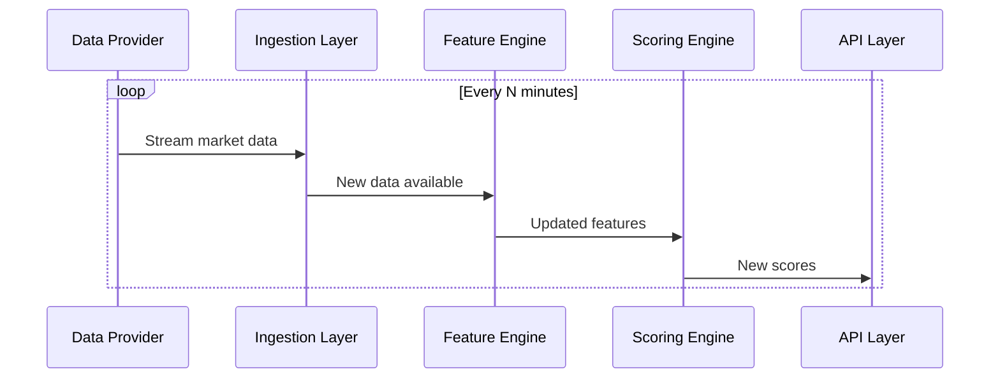
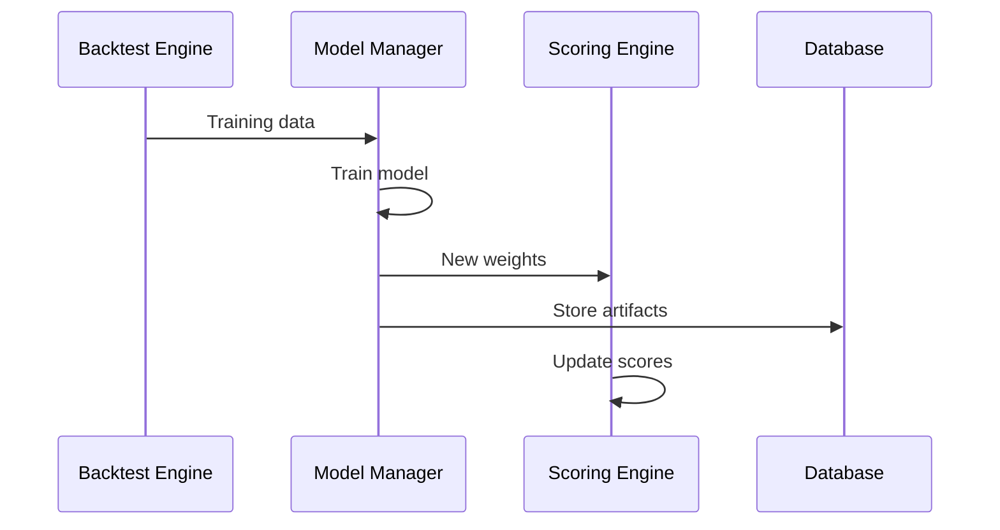

## Market Research Agent — Low-Level Design (Factor-Scoring Framework)

This document defines a detailed low-level design to implement a factor-scoring quantitative agent for Indian equity markets. The agent computes multi-category factor scores for every stock, aggregates them into ranked signals, stores analysis/results, and learns from past outcomes daily. It supports pre-market, intraday, and post-market runs.

### Goals / Success Criteria
- Provide per-stock daily scores that quantify likelihood of positive short/medium-term movement (configurable horizons).
- Support scheduled runs: pre-market (before open), during-market (intraday periodic), and post-market (after close/backtest update).
- Persist raw data, features, scores, model versions, and outcomes for continual learning.
- Be explainable (per-factor contribution) and auditable.

### High-level Architecture

#### System Components & Interactions

1. Data Ingestion Layer
- Components:
  - Data Provider Adapters
    - Interface: `DataProviderAdapter[T]` with methods:
      ```python
      async def fetch_data(self, symbols: List[str], start_date: datetime, end_date: datetime) -> Dict[str, pd.DataFrame]
      async def validate_data(self, df: pd.DataFrame) -> Tuple[bool, List[str]]  # returns (is_valid, errors)
      ```
    - Implementations:
      - `OHLCVAdapter` (Yahoo, NSE direct)
      - `FundamentalsAdapter` (Screener, Exchange filings)
      - `CorporateActionsAdapter`
      - `OptionsChainAdapter`
      - `MacroAdapter` (RBI data)
      - `SentimentAdapter` (News API)
  
  - Data Quality Layer
    - Validation rules engine
    - Gap detection & interpolation
    - Outlier detection
    - Data freshness monitoring

  - Ingestion Pipeline
    ```python
    class IngestionPipeline:
        async def ingest(self, universe: str, data_type: str) -> IngestResult:
            providers = self.get_providers(data_type)  # ordered by priority
            for provider in providers:
                try:
                    data = await provider.fetch_data(...)
                    if self.validate(data):
                        await self.store(data)
                        return Success
                except ProviderError:
                    continue  # try next provider
            return Failure
    ```

2. ETL / Feature Engineering
- Components:
  - Data Preprocessor
    - Corporate action adjustment
    - Time series alignment
    - Missing data handling
  
  - Feature Computer
    ```python
    class FeatureComputer:
        def compute_features(self, data: Dict[str, pd.DataFrame]) -> Dict[str, pd.DataFrame]:
            features = {}
            for category in self.enabled_categories:
                calculator = self.get_calculator(category)
                features[category] = calculator.compute(data)
            return features
    ```
  
  - Feature Categories (separate modules):
    - TechnicalFeatures (price/volume based)
    - FundamentalFeatures (financial ratios)
    - SentimentFeatures (news/social)
    - MacroFeatures (economic indicators)
    - EventFeatures (corporate events)
    - OptionsFeatures (derivatives data)

3. Feature Store
- Implementation:
  ```sql
  CREATE TABLE features (
      symbol TEXT,
      ts TIMESTAMPTZ,      -- hypertable partition key
      category TEXT,
      feature_name TEXT,
      value DOUBLE PRECISION,
      metadata JSONB,      -- quality metrics, source info
      PRIMARY KEY (symbol, ts, feature_name)
  );
  CREATE INDEX ON features (feature_name, ts DESC);
  ```
- Query Interface:
  ```python
  async def get_features(
      symbols: List[str],
      features: List[str],
      start_ts: datetime,
      end_ts: datetime,
      interval: str = '1d'
  ) -> Dict[str, pd.DataFrame]
  ```

4. Scoring Engine
- Components:
  - Normalizer
    ```python
    class Normalizer:
        def normalize(self, features: Dict[str, pd.DataFrame], method: str) -> Dict[str, pd.DataFrame]:
            if method == 'zscore':
                return self._zscore_normalize(features)
            elif method == 'rank':
                return self._rank_normalize(features)
    ```
  
  - Weight Manager
    ```python
    class WeightManager:
        def get_weights(self) -> Dict[str, float]:
            if self.use_learned_weights:
                return self.model.get_latest_weights()
            return self.config.get_static_weights()
        
        def update_weights(self, new_weights: Dict[str, float]):
            self.validate_weights(new_weights)  # sum to 1, constraints
            self.store_weights(new_weights)
    ```
  
  - Score Computer
    ```python
    class ScoreComputer:
        def compute_scores(
            self,
            features: Dict[str, pd.DataFrame],
            weights: Dict[str, float]
        ) -> Tuple[pd.Series, Dict]:
            normalized = self.normalizer.normalize(features)
            scores = self.aggregate(normalized, weights)
            explanations = self.explain_scores(normalized, weights)
            return scores, explanations
    ```

5. Learning & Backtest Module
- Components:
  - Dataset Builder
    ```python
    class DatasetBuilder:
        def build_training_data(
            self,
            start_date: datetime,
            end_date: datetime,
            horizon_days: int
        ) -> Tuple[pd.DataFrame, pd.Series]:  # (X_features, y_returns)
    ```
  
  - Model Manager
    ```python
    class ModelManager:
        def train_model(self, X: pd.DataFrame, y: pd.Series) -> Dict:
            model = self.create_model()  # XGBoost/LightGBM
            model.fit(X, y)
            weights = self.extract_weights(model)
            return {
                'weights': weights,
                'metrics': self.compute_metrics(model, X, y),
                'artifacts': self.serialize_model(model)
            }
    ```
  
  - Backtest Engine
    ```python
    class BacktestEngine:
        def run_backtest(
            self,
            strategy: TradingStrategy,
            start_date: datetime,
            end_date: datetime
        ) -> BacktestResults:
            universe = self.get_universe(start_date)
            for date in self.date_range(start_date, end_date):
                scores = self.compute_historical_scores(date)
                signals = strategy.generate_signals(scores)
                self.simulate_trades(signals)
            return self.compute_performance_metrics()
    ```

6. API Layer
- FastAPI Implementation:
  ```python
  @app.get("/v1/scores/{symbol}")
  async def get_symbol_scores(
      symbol: str,
      date: datetime = Query(default=None),
      explain: bool = Query(default=False)
  ):
      scores = await score_service.get_scores(symbol, date)
      if explain:
          return {
              "scores": scores,
              "components": await score_service.get_score_components(symbol, date)
          }
      return {"scores": scores}
  
  @app.post("/v1/run")
  async def trigger_run(
      run_config: RunConfig,
      background_tasks: BackgroundTasks
  ):
      run_id = await scheduler.schedule_run(run_config)
      return {"run_id": run_id}
  ```

7. Storage & Ops
- Database:
  - TimescaleDB for time-series (OHLCV, features)
  - PostgreSQL for metadata, models, config
  - Redis for real-time cache (latest scores, active runs)

- Message Bus (Kafka topics):
  ```
  market-data-raw          # raw ingested data
  feature-updates         # computed features
  score-updates          # new scores
  model-updates         # weight updates
  system-metrics        # monitoring data
  ```

- Scheduler (Airflow DAGs):
  ```python
  with DAG('market_research_daily', schedule='0 9 * * 1-5') as dag:
      ingest = PythonOperator(
          task_id='ingest_data',
          python_callable=run_ingestion
      )
      compute = PythonOperator(
          task_id='compute_features',
          python_callable=compute_features
      )
      score = PythonOperator(
          task_id='compute_scores',
          python_callable=compute_scores
      )
      
      ingest >> compute >> score
  ```

#### Inter-service Communication

1. Real-time Flow (During Market)


2. Model Update Flow


#### Error Handling & Recovery

1. Data Provider Failure
- Fallback chain with priority
- Automatic retry with exponential backoff
- Alert if all providers fail

2. Feature Computation Errors
- Skip invalid features, continue with subset
- Log detailed error context
- Mark affected scores as partial/degraded

3. Model Training Issues
- Retain previous weights
- Alert on significant performance drop
- Maintain backup models

#### Monitoring & Alerting

1. Data Quality Metrics
- Freshness (delay from real-time)
- Completeness (% of expected data points)
- Accuracy (vs alternative sources)

2. System Health
- Component latency
- Error rates
- Resource utilization

3. Business Metrics
- Score predictive power
- Portfolio performance
- Model drift

#### Deployment Architecture

1. Development Environment
- Local PostgreSQL
- File-based storage
- Minimal scheduling

2. Production Environment
- Containerized services
- Managed databases
- Full monitoring stack
- Load balancers
- Multiple availability zones### Tech Stack (recommended)
- Language: Python 3.11+
- Data: PostgreSQL (TimescaleDB if heavy time-series), S3 (or local FS) for raw files
- Orchestration: Airflow or Prefect for complex schedules; Cron/Celery for simpler setups
- ML: scikit-learn, xgboost/lightgbm, optuna for hyperparam tuning; SHAP for explainability
- APIs: FastAPI for serving; Streamlit/React for dashboards
- Containerization: Docker; k8s optional for scale

### Data Sources (Indian-market focused)
- Price / OHLCV
	- NSE/BSE official feeds (preferred, paid)
	- Yahoo Finance / Alpha Vantage / Tiingo (free and limited) — verify ticker mappings for Indian symbols
- Fundamentals
	- Exchange disclosures, financial statements (nseindia live filings), public datasets (screener.in, moneycontrol scraped with care), commercial providers
- Options/F&O
	- NSE option chain API or exchange data for Greeks and open interest
- News & Social
	- NewsAPI, Google News scraping, X/Twitter API, public finance forums
- Macro & Commodities
	- RBI, Ministry of Statistics, Bloomberg/Refinitiv for paid options

Assumption: A paid, reliable market data subscription is recommended for production (clean OHLCV, corporate actions, and option chains). The design supports fallback to free sources for prototyping.

### Data Schema (key tables)

Note: use TimescaleDB hypertables for OHLCV and feature timeseries.

- raw_prices (symbol, ts, open, high, low, close, volume, adj_close, source)
- raw_financials (symbol, period_end, fiscal_type, field_name, value, source)
- corporate_actions (symbol, date, type, details)
- option_chain_snapshots (symbol, ts, strikes[], calls[], puts[])
- sentiment_raw (symbol, ts, source, text, sentiment_score)

- features (symbol, ts, feature_name, value)
- scores (symbol, ts, score_type, score_value, components JSON)
- analysis_runs (run_id, run_type, start_ts, end_ts, config_id, status)
- models (model_id, version, weights_blob, metadata, created_ts)
- outcomes (symbol, ts, horizon, return, label)

### Factor List & Derived Features

Map the user's high-level categories to concrete computed features:

1) Fundamental Factors (company-specific)
- Financial Performance
	- revenue_ttm, revenue_yoy, eps_ttm, eps_yoy, gross_margin, op_margin, net_margin
	- fcf_ttm, fcf_margin, operating_cashflow
	- roe, roa, leverage_ratio (total_debt / total_equity)
	- dividend_yield, buyback_announcements (binary), payout_ratio
- Valuation
	- pe_ttm, ps_ttm, pb, ev_ebitda
	- peg (pe / earnings_growth_rate)
	- implied_dcf_gap = (market_price - dcf_intrinsic) / dcf_intrinsic
	- forward_pe, normalized_pe
- Management & Strategy
	- ceo_change_12m (binary), cfo_change_12m, insider_trading_score, r_and_d_to_revenue

2) Technical Factors
- Price & Volume
	- sma_20, sma_50, sma_200, ema_20
	- crossover_signals (20/50, 50/200)
	- volume_rel = volume / average_volume_20
	- rsi_14, macd, price_momentum_1w/1m/3m
	- ATR (volatility), beta (against NIFTY)
- Microstructure
	- bid_ask_spread, depth_ratio (where level2 available), short_interest_ratio

3) Macro & External
- interest_rate_change_3m, cpi_yoy, gdp_qoq, fx_inr_usd_change, oil_price_change

4) Sentiment
- news_sentiment_24h, social_sentiment_24h, sentiment_volume_ratio

5) Event-Driven
- earnings_surprise_pct, next_earnings_date_proximity, major_announcement_flag

6) Sector & Industry
- sector_relative_strength, sector_momentum, industry_pe

7) Market-wide & Liquidity
- etf_inflow_ratio, index_inclusion_flag, avg_daily_turnover

8) Quant & Options
- options_oi_change, put_call_ratio, gamma_exposure_estimate, options_iv_surface_slope

Each feature computed with time-windows (e.g., TTM, 3m, 12m) and tagged with confidence/quality metadata.

### Normalization & Scoring

Normalization options (choose/configurable per factor):
- z-score across universe (mean/std) using rolling window (e.g., 90d)
- rank percentile (0-1) across universe
- min-max scaling with clipping to avoid outliers

Score composition:
- Each factor gets a normalized score s_i in [-1,1] or [0,1] depending on transform.
- Weights w_i are defined per factor and optionally grouped by category. Weights sum to 1 (or normalized after aggregation).

Aggregate score computation (config-driven):

score(symbol, t) = sum_i w_i * s_i(symbol, t)

Where w_i are loaded from a configuration file (JSON) and can be static or produced by the Learning Module.

Component explanations stored with each score: components JSON = [{"factor":"pe_ttm","weight":0.05,"value":12.4,"norm":0.7}] so users can drill into what drove the score.

Example weight config (JSON):

{
	"categories": {
		"fundamental": 0.35,
		"technical": 0.25,
		"macro": 0.10,
		"sentiment": 0.10,
		"events": 0.10,
		"liquidity": 0.05,
		"quant": 0.05
	},
	"factors": {
		"eps_yoy": 0.12,
		"revenue_yoy": 0.08,
		"pe_ttm": 0.05,
		"sma_50_200_crossover": 0.06,
		"rsi_14": 0.04,
		"news_sentiment_24h": 0.05
	}
}

Weights can be constrained (e.g., no negative weights for certain categories) and normalized automatically by the engine.

### Learning Weights (daily learning loop)

Approach A (supervised ranking):
- Create training dataset where input X = factor vector at time t, label Y = realized return over horizon H (e.g., next 5 days) or binary target (top decile returns = 1).
- Train a model (e.g., gradient boosting) to predict returns or probability of positive outcome. Extract feature importances or prediction coefficients and convert to weights.

Approach B (constrained optimization):
- Optimize weights w to maximize backtest objective (e.g., information ratio, Sharpe, cumulative return) subject to risk constraints. Use CV or walk-forward.

Implementation details:
- Keep separate training windows (rolling) and a validation window to avoid lookahead.
- Regularize weights to avoid overfitting; use L1/L2 or limit number of active factors.
- Produce model artifacts (weights_blob) stored in `models` table with versioning.

Online learning & adaptation:
- Recompute weights weekly or monthly, and optionally allow daily small adjustments by an online learner with very limited step-size.

### Evaluation & Backtesting

Backtest engine must simulate trading realistically:
- Use transaction cost model (slippage, spread) and position sizing (equal-weight, volatility scaled, risk-parity).
- Evaluate metrics: cumulative return, annualized return, volatility, Sharpe, max drawdown, hit rate, precision@k, NDCG for ranking.
- Walk-forward/backtest with rolling windows and report performance by sector and market regimes (bull/bear).

Validation checks:
- Check for lookahead bias and survivorship bias.
- Use only data available up to decision time.

### Scheduling (pre/during/post-market flows)

- Pre-market (before market open):
	1. Ingest overnight data and news
	2. Update fundamentals if new filings
	3. Recompute features and scores
	4. Run models to update weights (if scheduled for that day)
	5. Store `scores` with `run_type=pre-market`

- During-market (intraday periodic, e.g., every 15m or 60m):
	1. Stream/ingest latest tick/1m OHLCV
	2. Recompute intraday features (momentum, volume spikes, orderbook imbalance)
	3. Recompute and publish intraday scores for monitoring and tactical signals

- Post-market (after close):
	1. Compute daily returns and outcomes labels
	2. Run backtest updates and retrain weights (offline)
	3. Persist learning artifacts and produce daily report (performance and model changes)

### APIs and Data Contracts

REST API endpoints (FastAPI example):
- GET /v1/scores?date=YYYY-MM-DD&universe=nse500 -> list of scores and top-k
- GET /v1/scores/{symbol}?date=... -> score and components for symbol
- GET /v1/features/{symbol}?feature=pe_ttm&start=&end= -> feature time series
- POST /v1/run -> trigger manual run, with payload {"run_type":"pre-market","config_id":x}

Payload formats are JSON; components use compact JSON for factor breakdown.

---

### API Endpoints: Factor Score Transparency & Full Factor Breakdown

#### 1. `/score` (POST)
- **Purpose:** Compute and return the aggregate score for each stock, along with a full breakdown of all factor values, normalizations, weights, and contributions used in the scoring process.
- **Request:**
  - `symbols`: List[str] — Stock symbols to score
  - `factors`: Optional[List[str]] — Factors to use (default: all available)
  - `weights`: Optional[Dict[str, float]] — Factor weights (default: equal)
  - `date`: Optional[str] — Date for which to compute (default: latest)
- **Response:**
  - For each symbol:
    - `score`: float — Final aggregate score
    - `factors`: Dict[str, Dict] — For each factor:
      - `value`: float — Raw value used for scoring
      - `normalized`: float — Z-score normalized value
      - `weight`: float — Weight applied
      - `contribution`: float — Weighted contribution to the score

**Example Response:**
```json
{
  "RELIANCE": {
    "score": 0.42,
    "factors": {
      "sma_20": {"value": 123.4, "normalized": 0.12, "weight": 0.2, "contribution": 0.024},
      "rsi_14": {"value": 55.1, "normalized": -0.08, "weight": 0.2, "contribution": -0.016}
      // ...other factors
    }
  },
  "TCS": {
    "score": -0.11,
    "factors": {
      // ...factor details
    }
  }
}
```

**Implementation Details:**
- The API handler should:
  1. Fetch the latest feature values for each symbol and factor.
  2. Normalize values using `normalize_zscore` (from `scoring.py`).
  3. Compute the aggregate score and per-factor contributions using `aggregate_score` and `components`.
  4. Return all raw values, normalized values, weights, and contributions in the response.
- If a factor value is missing for a symbol, return `null` or indicate missing data.
- If weights are not provided, use equal weighting.
- If no factors are specified, use all available factors.
- For large universes or many factors, consider pagination or limiting factors in production.

#### 2. `/factors` (GET)
- **Purpose:** List all available factors and their metadata (description, window, etc.).
- **Response:**
  - `factors`: List[Dict] — Each with `name`, `description`, `window`, `value_type`, etc.

---

### Analysis of Current Suggestion

**Strengths:**
- Provides full transparency and explainability: users see not just the score, but exactly how each factor contributed.
- Supports auditability and regulatory requirements.
- Design is extensible: new factors or changes in weighting logic are automatically reflected in the API output.

**Potential Gaps:**
- The API and feature store must ensure all requested factors are available for each symbol and date.
- For very large universes or many factors, response size could be large; consider pagination or limiting factors in production.
- If a factor is missing for a symbol, the API should clearly indicate this (e.g., `null` value or error field).

**Actionable Next Steps:**
- Update the API endpoint implementation to return the full factor breakdown as shown above.
- Add tests to ensure the API returns all expected fields and handles missing data gracefully.
- Document the endpoint and response structure for users.

---

### Storage & Retention
- Raw ticks/1m pricedata: retain 6-12 months in DB, archive older to object store
- Daily OHLCV & computed features: retain indefinitely in TimescaleDB
- Models & artifacts: retain versions with metadata
- Retention policy configurable via S3 lifecycle

### Observability, Monitoring & Alerts
- Logging: structured logs for ingestion failures and data quality flags
- Metrics: run durations, data freshness, number of symbols processed, missing data ratios
- Alerts: data source outage, major drop in backtest performance, model drift detection

### Security & Compliance
- Protect API keys and credentials in secrets manager
- Respect exchange data licensing; do not re-distribute paid data
- Sanitize scraped sources and conform to robots.txt where applicable

### Edge Cases & Quality Controls
- Missing fundamentals: impute conservatively or mark factor as low-confidence
- Delisted symbols: archive and stop scoring
- Corporate actions: always adjust historical prices for splits/dividends
- Outliers: clip extreme z-scores and use robust scaling when necessary
- Surviving/selection bias: ensure backtests include delisted companies or use survivorship-corrected universe

### Testing Strategy & Quality Assurance

For detailed testing strategy and implementation, see [TESTING.md](TESTING.md). Key testing areas:

1. Unit Testing (per component)
- Data Providers: Data fetching, validation, error handling
- Feature Computation: Accuracy, boundary conditions
- Feature Store: CRUD operations, data consistency
- Scoring Engine: Weight calculations, normalization
- API Layer: Endpoint functionality, error responses
- Scheduler: Job execution, timing accuracy

2. Integration Testing
- End-to-end data flow from ingestion to scoring
- API endpoints with live data
- Job scheduler with full pipeline execution
- Database and cache interactions

3. Performance Testing
- Load testing for batch operations
- Concurrency testing for parallel processing
- Resource usage under different loads
- Response time metrics

4. Quality Control Testing
- Data quality validation
- Feature computation accuracy
- Score consistency and bounds
- Model weight validation

5. System Testing
- Configuration management
- Error recovery and fallbacks
- Environment setup and tear down
- Service communication

6. Backtesting & Model Testing
- Strategy performance metrics
- Model training and validation
- Weight optimization
- Lookahead bias prevention

7. Monitoring & Alert Testing
- Alert trigger conditions
- Performance metric tracking
- Resource monitoring
- Data freshness checks

### Explainability & Reporting
- Store component contributions for each symbol-day for auditing
- Provide SHAP or feature-importance snapshots for model-based weight learners
- Daily digest report: top/bottom ranked stocks with reasons, model changes, market context

### Minimal Viable Implementation Plan
1. Prototype data ingestion for daily OHLCV for NSE 200 symbols (Yahoo/AlphaVantage or exchange feed)
2. Implement core feature computations (fundamental ratios, SMA, RSI, momentum)
3. Implement normalization, static weight scoring engine and store scores
4. Build simple FastAPI endpoints to serve scores and explanations
5. Implement backtest harness and train a small supervised learner for weights
6. Add scheduled runs (pre/during/post) and persistence

### Implementation Timeline (suggested)
- Week 1: Data ingestion + feature prototypes for limited universe
- Week 2: Scoring engine + simple UI/API
- Week 3: Backtest framework + supervised weighting prototype
- Week 4: Explainability, reporting, and QA tests

### Assumptions & Limitations
- High-quality exchange or paid data is assumed for production accuracy.
- Intraday orderbook-level features are optional and require access to Level-2 feeds.
- Legal/licensing responsibilities for scraping or storing exchange data are the user's responsibility.

### Configurability: Universe, Data Providers, Cadence & Retention

This system is designed to be highly configurable. Below are specific recommendations and implementation notes so the agent can be adapted to different users, budgets, and operating modes.

1) Target Universe (configurable)
- Description: Support multiple predefined universes and custom watchlists to control the symbol set the agent processes.
- Options:
	- preset: "NSE200", "NIFTY500", "NIFTY50", etc.
	- custom: list of tickers or reference to a watchlist table (e.g., `watchlists.custom_1`).
- Implementation notes:
	- Store universe definitions in a `config/universes.yaml` or DB table `universes(name, filter_sql_or_list, updated_ts)`.
	- Allow runtime overrides (API payload / CLI flag) for ad-hoc runs.
	- Universe config should include rebalancing cadence (e.g., monthly re-evaluate membership) and survivorship handling.

2) Data Provider(s) (configurable with priority/fallback)
- Description: Allow multiple providers for price and fundamentals with prioritized fallbacks (paid -> free) and provider-specific adapters.
- Config keys:
	- prices: [{name: "exchange", type: "paid", adapter: "nse_feed", priority: 10, credentials_id: "secrets/nse"}, {name:"yahoo", type:"free", adapter:"yahoo", priority:5}]
	- fundamentals: [{name:"exchange_filings", type:"paid", priority: 10}, {name:"screener", type:"scrape", priority:3}]
- Implementation notes:
	- Build small adapter interface: fetch_prices(symbols, start, end, resolution) and fetch_financials(symbol, periods).
	- Runtime provider selection: try highest-priority provider; on failure, transparently fall back to next provider and log the event.
	- Record provider metadata with all ingested rows (source, confidence, latency) for debugging and lineage.
	- Rate-limit and backoff logic per provider; allow scheduled sync windows for rate-limited APIs.

3) Execution Cadence & Retention (configurable)
- Execution cadence:
	- intraday.interval_minutes: default 60 (set to 15, 30, 60 etc.)
	- pre_market.run_at: ISO time before open (e.g., "09:00")
	- post_market.run_at: ISO time after close (e.g., "16:30")
	- live_stream.enabled: boolean, with max_batch_latency_secs for streaming mode
- Retention policy:
	- raw_tick_retention_days (default 90)
	- ohlcv_retention_days (default keep daily indefinitely, but allow archiving older than 3 years to object store)
	- feature_retention_days (keep features indefinitely for backtesting, with optional compression)
	- model_artifact_retention (versions to keep)
- Implementation notes:
	- Put cadence and retention in a single `config/system.yaml` used by scheduler and archival jobs.
	- Scheduler (Airflow/Prefect/Cron) should read cadence config and spawn jobs accordingly.
	- Archival worker moves old raw data to object store and replaces DB rows with pointers to archives to control DB size.

Example config snippet (YAML):

```yaml
universe:
	name: "NSE200"
	type: "preset"

providers:
	prices:
		- name: "nse_exchange"
			type: "paid"
			adapter: "nse_adapter"
			priority: 10
			credentials: "secrets/nse"
		- name: "yahoo"
			type: "free"
			adapter: "yahoo_adapter"
			priority: 5

cadence:
	pre_market: "09:00"
	intraday_interval_minutes: 15
	post_market: "16:30"

retention:
	raw_tick_days: 90
	ohlcv_archive_after_days: 365
	features_keep_indefinitely: true
```

How this affects other components:
- Feature Engine and Scoring Engine should accept a `universe` argument and only compute for symbols in that universe.
- Backtest and Model Training should support runs constrained to a universe and tag models with the universe they were trained on.
- Monitoring/alerts should be universe-aware (e.g., per-universe data freshness)

### Next Steps (recommended)
1. Confirm target universe (NSE200, NIFTY500, custom watchlist).
2. Pick data provider(s) for prices and fundamentals (paid vs free).
3. Decide execution cadence (every 15m intraday or hourly) and retention policy.
4. If you want, I can scaffold a starter prototype (Python package, basic ingestion + scoring + FastAPI) in this repo.

## Appendix: Example scoring pseudocode

1. Load universe symbols and latest data
2. For each symbol, compute features f_i
3. Normalize features -> s_i
4. Load weights w_i (from config or latest trained model)
5. Compute score = sum(w_i * s_i)
6. Save score row with components for explainability

## Appendix: Key Evaluation Metrics for Production Monitoring
- Precision@K, Recall@K, NDCG
- Daily/Weekly return of top-k portfolio (net of costs)
- Turnover, average holding period
- Model stability: KL divergence between weight distributions across retrains

---

File created/updated to implement the user's requested LLD for the factor-scoring agent.

### Comprehensive End-to-End Testing & Validation

To guarantee every feature and component works as intended, the following end-to-end testing and validation strategy must be implemented. This ensures not only unit correctness but also integration, system, and operational reliability across all scenarios, including edge cases and failure recovery.

#### 1. Data Ingestion Layer
- **Test all provider adapters** (OHLCV, Fundamentals, Corporate Actions, Options, Macro, Sentiment):
  - Simulate successful and failed fetches (network errors, API limits, malformed data).
  - Validate fallback logic and provider prioritization.
  - Test data validation rules, gap detection, outlier handling, and freshness monitoring.
  - Ensure ingestion pipeline stores data only if valid and logs all errors/fallbacks.
  - Test ingestion with missing, duplicate, and out-of-order data.

#### 2. ETL / Feature Engineering
- **Test Data Preprocessor**:
  - Corporate action adjustment correctness (splits, dividends, mergers).
  - Time series alignment for multi-source data.
  - Handling of missing, partial, or delayed data.
- **Test Feature Computer**:
  - Each feature category (Technical, Fundamental, Sentiment, Macro, Event, Options):
    - Compute with valid, missing, and extreme input data.
    - Validate output shape, NaN/infinity handling, and expected value ranges.
    - Test feature enable/disable logic and category switching.
  - Test feature computation for large universes and long time windows.

#### 3. Feature Store
- **Test storage and retrieval**:
  - CRUD operations for all feature types, including metadata and quality tags.
  - Querying by symbol, feature, time range, and interval.
  - Test concurrent writes/reads and data consistency under load.
  - Simulate DB failures and recovery (e.g., TimescaleDB restarts).
  - Validate retention and archival logic.

#### 4. Scoring Engine
- **Test Normalizer**:
  - Z-score, rank, and min-max normalization with various distributions.
  - Outlier and clipping logic.
- **Test Weight Manager**:
  - Static and learned weights, sum-to-1 and constraint validation.
  - Weight update, rollback, and versioning.
- **Test Score Computer**:
  - Aggregation logic, explanation output, and error propagation.
  - Test with missing features, partial data, and category exclusion.

#### 5. Learning & Backtest Module
- **Test Dataset Builder**:
  - Training set construction with rolling/expanding windows.
  - Label generation for different horizons and return types.
- **Test Model Manager**:
  - Model training, hyperparameter tuning, and artifact serialization.
  - Weight extraction and metrics computation.
  - Model versioning, rollback, and drift detection.
- **Test Backtest Engine**:
  - Simulate trading with various strategies, transaction costs, and position sizing.
  - Validate walk-forward, lookahead bias prevention, and performance metrics.
  - Test with incomplete, noisy, and out-of-sample data.

#### 6. API Layer
- **Test all endpoints**:
  - GET/POST for scores, features, runs, and explanations.
  - Input validation, error responses, and edge cases (missing symbol, invalid date, etc).
  - Test with large payloads, concurrent requests, and rate limiting.
  - Security: test authentication, authorization, and input sanitization.

#### 7. Storage & Ops
- **Test database and cache**:
  - Failover, backup/restore, and data integrity after recovery.
  - Redis cache invalidation and real-time update propagation.
- **Test message bus**:
  - Kafka topic publishing/consuming, message loss, and ordering.
  - Simulate network partitions and recovery.
- **Test scheduler**:
  - Airflow/Cron job execution, missed/duplicate runs, and manual triggers.
  - Test job chaining, retries, and alerting on failure.

#### 8. Monitoring, Alerting, and Observability
- **Test all metrics and alerts**:
  - Data quality, system health, business metrics, and custom thresholds.
  - Simulate metric spikes, data delays, and error bursts.
  - Validate alert delivery (email, Slack, etc) and escalation.

#### 9. Security & Compliance
- **Test secrets management**:
  - Credential rotation, access control, and audit logging.
- **Test data privacy**:
  - Masking/sanitization of sensitive data in logs and exports.
- **Test compliance with data licensing and regulatory requirements.

#### 10. Edge Cases & Operational Resilience
- **Test all edge scenarios**:
  - Delisted symbols, new IPOs, corporate actions, and universe changes.
  - Outlier detection, robust scaling, and fallback for missing fundamentals.
  - Survivorship bias checks in backtests.

#### 11. End-to-End System Tests
- **Full pipeline runs**:
  - Pre-market, intraday, and post-market flows with real and synthetic data.
  - Simulate failures at each stage and verify recovery.
  - Validate that all outputs (scores, features, models, reports) are correct and complete.

#### 12. CI/CD & Automation
- **Automate all tests in CI/CD**:
  - Run all test suites (unit, integration, system, performance) on every commit.
  - Enforce code coverage, linting, and static analysis.
  - Deploy to staging and run smoke tests before production.

#### 13. Documentation & Reporting
- **Test documentation completeness**:
  - Ensure all APIs, configs, and data contracts are documented and versioned.
  - Generate daily/weekly reports with test results, coverage, and system health.

---

**Summary:**
- Every function, feature, and integration point must have explicit tests for both success and failure scenarios.
- All edge cases, error handling, and operational flows are covered.
- The system is validated for correctness, reliability, and maintainability in real-world and adverse conditions.
- See [TESTING.md](TESTING.md) for detailed test cases and code examples.

### Scenario Coverage & End-to-End Implementation Checklist

To ensure the system is robust, maintainable, and production-ready, the following scenarios and operational modes must be explicitly implemented and tested:

#### Data Ingestion & Provider Fallback
- Multi-provider fallback for all data types (OHLCV, fundamentals, options, macro, sentiment):
  - Simulate primary provider outage, API quota exhaustion, and data corruption.
  - Validate fallback to secondary/tertiary providers and log all transitions.
  - Test provider-specific quirks (e.g., symbol mapping, timezone differences, data delays).
- Dynamic provider configuration:
  - Allow runtime addition/removal of providers and priority changes without downtime.
- Data freshness and completeness:
  - Monitor and alert if data is stale or incomplete for any symbol or feature.

#### Universe Management
- Dynamic universe changes:
  - Add/remove symbols (e.g., IPOs, delistings, index rebalancing) and ensure all downstream components adapt.
  - Test universe rebalancing logic and survivorship bias handling in backtests.
- Ad-hoc and scheduled universe overrides:
  - Support custom watchlists and on-demand runs for arbitrary symbol sets.

#### Feature Engineering & Data Quality
- Feature computation with missing, partial, or delayed data:
  - Impute, skip, or flag low-confidence features.
- Corporate actions:
  - Adjust for splits, dividends, and mergers; test with real and synthetic events.
- Outlier and anomaly detection:
  - Detect and handle extreme values, data spikes, and sensor errors.
- Feature versioning:
  - Track changes in feature definitions and recalculate as needed.

#### Scoring, Normalization, and Weighting
- Multiple normalization strategies:
  - Switch between z-score, rank, min-max, and custom transforms per factor.
- Weighting strategies:
  - Static, learned, and hybrid weights; test constraint enforcement and sum-to-1 normalization.
- Score explainability:
  - Store and serve per-factor contributions for every score.
- Partial/incomplete feature sets:
  - Compute scores with missing features and flag degraded results.

#### Model Training, Drift, and Retraining
- Model retraining triggers:
  - Scheduled (e.g., weekly/monthly) and event-driven (e.g., drift detected, performance drop).
- Data drift and model monitoring:
  - Detect changes in feature distributions and alert on significant drift.
- Model rollback and versioning:
  - Roll back to previous model/weights on performance degradation.
- Hyperparameter tuning:
  - Support grid/random/optuna search and log all experiments.

#### Backtesting & Evaluation
- Walk-forward and rolling window backtests:
  - Simulate realistic trading with lookahead prevention.
- Multiple strategies:
  - Test equal-weight, risk-parity, and custom strategies.
- Transaction cost and slippage modeling:
  - Parameterize and test with different cost assumptions.
- Regime-aware evaluation:
  - Segment performance by bull/bear/sideways markets.

#### API, CLI, and User Flows
- All REST endpoints:
  - Test with valid, invalid, and edge-case inputs (e.g., future dates, unknown symbols).
- CLI commands:
  - Collect, serve, scheduler, and custom runs; test with all config permutations.
- Pagination, filtering, and sorting in API responses.
- Authentication and authorization:
  - Role-based access, API key rotation, and audit logging.

#### Scheduler, Jobs, and Recovery
- Pre-market, intraday, and post-market job flows:
  - Simulate missed, delayed, and duplicate jobs; ensure idempotency.
- Manual and automated job triggers.
- Job chaining, retries, and alerting on failure.
- Graceful shutdown and restart with job resumption.

#### Storage, Retention, and Archival
- Data retention policies:
  - Enforce raw, feature, and model retention/archival as per config.
- Backup, restore, and disaster recovery:
  - Test full and partial restores, point-in-time recovery, and failover.
- Data migration and schema evolution:
  - Handle schema changes without downtime or data loss.

#### Monitoring, Alerting, and Observability
- System health dashboards:
  - Latency, throughput, error rates, and resource usage.
- Data quality and freshness alerts.
- Business metric monitoring (e.g., predictive power, hit rate).
- Alert routing and escalation policies.

#### Security, Compliance, and Privacy
- Secrets management:
  - Test rotation, revocation, and least-privilege access.
- Data privacy:
  - Masking, anonymization, and export controls.
- Compliance with data licensing and regulatory requirements.

#### Edge Cases & Operational Resilience
- Delisted/merged symbols, ticker changes, and symbol reuse.
- Corporate actions on ex-date and retroactive adjustments.
- Network partitions, DB outages, and partial system failures.
- High-latency and low-bandwidth scenarios.
- Large-scale runs (e.g., all NSE500 symbols, 10+ years of history).

#### Documentation, Reporting, and User Support
- API and CLI documentation auto-generation and versioning.
- Daily/weekly reports with system health, data quality, and top signals.
- User feedback and support workflow for bug reports and feature requests.

---

**Implementation Note:**
- Every scenario above must be covered by explicit code, configuration, and automated tests (see [TESTING.md](TESTING.md)).
- All flows must be validated in both normal and failure modes, with clear logging, alerting, and recovery procedures.
- The system must be maintainable, extensible, and ready for production deployment in both cloud and on-prem environments.
