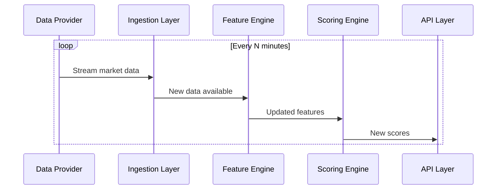
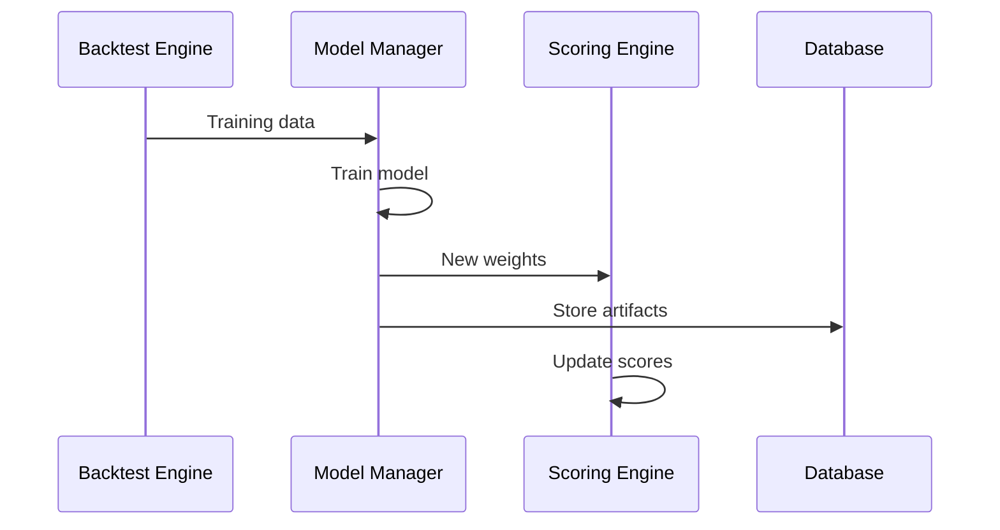

## Market Research Agent — Low-Level Design (Factor-Scoring Framework)

This document defines a detailed low-level design to implement a factor-scoring quantitative agent for Indian equity markets. The agent computes multi-category factor scores for every stock, aggregates them into ranked signals, stores analysis/results, and learns from past outcomes daily. It supports pre-market, intraday, and post-market runs.

### Goals / Success Criteria
- Provide per-stock daily scores that quantify likelihood of positive short/medium-term movement (configurable horizons).
- Support scheduled runs: pre-market (before open), during-market (intraday periodic), and post-market (after close/backtest update).
- Persist raw data, features, scores, model versions, and outcomes for continual learning.
- Be explainable (per-factor contribution) and auditable.

### High-level Architecture

#### System Components & Interactions

1. Data Ingestion Layer
- Components:
  - Data Provider Adapters
    - Interface: `DataProviderAdapter[T]` with methods:
      ```python
      async def fetch_data(self, symbols: List[str], start_date: datetime, end_date: datetime) -> Dict[str, pd.DataFrame]
      async def validate_data(self, df: pd.DataFrame) -> Tuple[bool, List[str]]  # returns (is_valid, errors)
      ```
    - Implementations:
      - `OHLCVAdapter` (Yahoo, NSE direct)
      - `FundamentalsAdapter` (Screener, Exchange filings)
      - `CorporateActionsAdapter`
      - `OptionsChainAdapter`
      - `MacroAdapter` (RBI data)
      - `SentimentAdapter` (News API)
  
  - Data Quality Layer
    - Validation rules engine
    - Gap detection & interpolation
    - Outlier detection
    - Data freshness monitoring

  - Ingestion Pipeline
    ```python
    class IngestionPipeline:
        async def ingest(self, universe: str, data_type: str) -> IngestResult:
            providers = self.get_providers(data_type)  # ordered by priority
            for provider in providers:
                try:
                    data = await provider.fetch_data(...)
                    if self.validate(data):
                        await self.store(data)
                        return Success
                except ProviderError:
                    continue  # try next provider
            return Failure
    ```

2. ETL / Feature Engineering
- Components:
  - Data Preprocessor
    - Corporate action adjustment
    - Time series alignment
    - Missing data handling
  
  - Feature Computer
    ```python
    class FeatureComputer:
        def compute_features(self, data: Dict[str, pd.DataFrame]) -> Dict[str, pd.DataFrame]:
            features = {}
            for category in self.enabled_categories:
                calculator = self.get_calculator(category)
                features[category] = calculator.compute(data)
            return features
    ```
  
  - Feature Categories (separate modules):
    - TechnicalFeatures (price/volume based)
    - FundamentalFeatures (financial ratios)
    - SentimentFeatures (news/social)
    - MacroFeatures (economic indicators)
    - EventFeatures (corporate events)
    - OptionsFeatures (derivatives data)

3. Feature Store
- Implementation:
  ```sql
  CREATE TABLE features (
      symbol TEXT,
      ts TIMESTAMPTZ,      -- hypertable partition key
      category TEXT,
      feature_name TEXT,
      value DOUBLE PRECISION,
      metadata JSONB,      -- quality metrics, source info
      PRIMARY KEY (symbol, ts, feature_name)
  );
  CREATE INDEX ON features (feature_name, ts DESC);
  ```
- Query Interface:
  ```python
  async def get_features(
      symbols: List[str],
      features: List[str],
      start_ts: datetime,
      end_ts: datetime,
      interval: str = '1d'
  ) -> Dict[str, pd.DataFrame]
  ```

4. Scoring Engine
- Components:
  - Normalizer
    ```python
    class Normalizer:
        def normalize(self, features: Dict[str, pd.DataFrame], method: str) -> Dict[str, pd.DataFrame]:
            if method == 'zscore':
                return self._zscore_normalize(features)
            elif method == 'rank':
                return self._rank_normalize(features)
    ```
  
  - Weight Manager
    ```python
    class WeightManager:
        def get_weights(self) -> Dict[str, float]:
            if self.use_learned_weights:
                return self.model.get_latest_weights()
            return self.config.get_static_weights()
        
        def update_weights(self, new_weights: Dict[str, float]):
            self.validate_weights(new_weights)  # sum to 1, constraints
            self.store_weights(new_weights)
    ```
  
  - Score Computer
    ```python
    class ScoreComputer:
        def compute_scores(
            self,
            features: Dict[str, pd.DataFrame],
            weights: Dict[str, float]
        ) -> Tuple[pd.Series, Dict]:
            normalized = self.normalizer.normalize(features)
            scores = self.aggregate(normalized, weights)
            explanations = self.explain_scores(normalized, weights)
            return scores, explanations
    ```

5. Learning & Backtest Module
- Components:
  - Dataset Builder
    ```python
    class DatasetBuilder:
        def build_training_data(
            self,
            start_date: datetime,
            end_date: datetime,
            horizon_days: int
        ) -> Tuple[pd.DataFrame, pd.Series]:  # (X_features, y_returns)
    ```
  
  - Model Manager
    ```python
    class ModelManager:
        def train_model(self, X: pd.DataFrame, y: pd.Series) -> Dict:
            model = self.create_model()  # XGBoost/LightGBM
            model.fit(X, y)
            weights = self.extract_weights(model)
            return {
                'weights': weights,
                'metrics': self.compute_metrics(model, X, y),
                'artifacts': self.serialize_model(model)
            }
    ```
  
  - Backtest Engine
    ```python
    class BacktestEngine:
        def run_backtest(
            self,
            strategy: TradingStrategy,
            start_date: datetime,
            end_date: datetime
        ) -> BacktestResults:
            universe = self.get_universe(start_date)
            for date in self.date_range(start_date, end_date):
                scores = self.compute_historical_scores(date)
                signals = strategy.generate_signals(scores)
                self.simulate_trades(signals)
            return self.compute_performance_metrics()
    ```

6. API Layer
- FastAPI Implementation:
  ```python
  @app.get("/v1/scores/{symbol}")
  async def get_symbol_scores(
      symbol: str,
      date: datetime = Query(default=None),
      explain: bool = Query(default=False)
  ):
      scores = await score_service.get_scores(symbol, date)
      if explain:
          return {
              "scores": scores,
              "components": await score_service.get_score_components(symbol, date)
          }
      return {"scores": scores}
  
  @app.post("/v1/run")
  async def trigger_run(
      run_config: RunConfig,
      background_tasks: BackgroundTasks
  ):
      run_id = await scheduler.schedule_run(run_config)
      return {"run_id": run_id}
  ```

7. Storage & Ops
- Database:
  - TimescaleDB for time-series (OHLCV, features)
  - PostgreSQL for metadata, models, config
  - Redis for real-time cache (latest scores, active runs)

- Message Bus (Kafka topics):
  ```
  market-data-raw          # raw ingested data
  feature-updates         # computed features
  score-updates          # new scores
  model-updates         # weight updates
  system-metrics        # monitoring data
  ```

- Scheduler (Airflow DAGs):
  ```python
  with DAG('market_research_daily', schedule='0 9 * * 1-5') as dag:
      ingest = PythonOperator(
          task_id='ingest_data',
          python_callable=run_ingestion
      )
      compute = PythonOperator(
          task_id='compute_features',
          python_callable=compute_features
      )
      score = PythonOperator(
          task_id='compute_scores',
          python_callable=compute_scores
      )
      
      ingest >> compute >> score
  ```

#### Inter-service Communication

1. Real-time Flow (During Market)


2. Model Update Flow


#### Error Handling & Recovery

1. Data Provider Failure
- Fallback chain with priority
- Automatic retry with exponential backoff
- Alert if all providers fail

2. Feature Computation Errors
- Skip invalid features, continue with subset
- Log detailed error context
- Mark affected scores as partial/degraded

3. Model Training Issues
- Retain previous weights
- Alert on significant performance drop
- Maintain backup models

#### Monitoring & Alerting

1. Data Quality Metrics
- Freshness (delay from real-time)
- Completeness (% of expected data points)
- Accuracy (vs alternative sources)

2. System Health
- Component latency
- Error rates
- Resource utilization

3. Business Metrics
- Score predictive power
- Portfolio performance
- Model drift

#### Deployment Architecture

1. Development Environment
- Local PostgreSQL
- File-based storage
- Minimal scheduling

2. Production Environment
- Containerized services
- Managed databases
- Full monitoring stack
- Load balancers
- Multiple availability zones### Tech Stack (recommended)
- Language: Python 3.11+
- Data: PostgreSQL (TimescaleDB if heavy time-series), S3 (or local FS) for raw files
- Orchestration: Airflow or Prefect for complex schedules; Cron/Celery for simpler setups
- ML: scikit-learn, xgboost/lightgbm, optuna for hyperparam tuning; SHAP for explainability
- APIs: FastAPI for serving; Streamlit/React for dashboards
- Containerization: Docker; k8s optional for scale

### Data Sources (Indian-market focused)
- Price / OHLCV
	- NSE/BSE official feeds (preferred, paid)
	- Yahoo Finance / Alpha Vantage / Tiingo (free and limited) — verify ticker mappings for Indian symbols
- Fundamentals
	- Exchange disclosures, financial statements (nseindia live filings), public datasets (screener.in, moneycontrol scraped with care), commercial providers
- Options/F&O
	- NSE option chain API or exchange data for Greeks and open interest
- News & Social
	- NewsAPI, Google News scraping, X/Twitter API, public finance forums
- Macro & Commodities
	- RBI, Ministry of Statistics, Bloomberg/Refinitiv for paid options

Assumption: A paid, reliable market data subscription is recommended for production (clean OHLCV, corporate actions, and option chains). The design supports fallback to free sources for prototyping.

### Data Schema (key tables)

Note: use TimescaleDB hypertables for OHLCV and feature timeseries.

- raw_prices (symbol, ts, open, high, low, close, volume, adj_close, source)
- raw_financials (symbol, period_end, fiscal_type, field_name, value, source)
- corporate_actions (symbol, date, type, details)
- option_chain_snapshots (symbol, ts, strikes[], calls[], puts[])
- sentiment_raw (symbol, ts, source, text, sentiment_score)

- features (symbol, ts, feature_name, value)
- scores (symbol, ts, score_type, score_value, components JSON)
- analysis_runs (run_id, run_type, start_ts, end_ts, config_id, status)
- models (model_id, version, weights_blob, metadata, created_ts)
- outcomes (symbol, ts, horizon, return, label)

### Factor List & Derived Features

Map the user's high-level categories to concrete computed features:

1) Fundamental Factors (company-specific)
- Financial Performance
	- revenue_ttm, revenue_yoy, eps_ttm, eps_yoy, gross_margin, op_margin, net_margin
	- fcf_ttm, fcf_margin, operating_cashflow
	- roe, roa, leverage_ratio (total_debt / total_equity)
	- dividend_yield, buyback_announcements (binary), payout_ratio
- Valuation
	- pe_ttm, ps_ttm, pb, ev_ebitda
	- peg (pe / earnings_growth_rate)
	- implied_dcf_gap = (market_price - dcf_intrinsic) / dcf_intrinsic
	- forward_pe, normalized_pe
- Management & Strategy
	- ceo_change_12m (binary), cfo_change_12m, insider_trading_score, r_and_d_to_revenue

2) Technical Factors
- Price & Volume
	- sma_20, sma_50, sma_200, ema_20
	- crossover_signals (20/50, 50/200)
	- volume_rel = volume / average_volume_20
	- rsi_14, macd, price_momentum_1w/1m/3m
	- ATR (volatility), beta (against NIFTY)
- Microstructure
	- bid_ask_spread, depth_ratio (where level2 available), short_interest_ratio

3) Macro & External
- interest_rate_change_3m, cpi_yoy, gdp_qoq, fx_inr_usd_change, oil_price_change

4) Sentiment
- news_sentiment_24h, social_sentiment_24h, sentiment_volume_ratio

5) Event-Driven
- earnings_surprise_pct, next_earnings_date_proximity, major_announcement_flag

6) Sector & Industry
- sector_relative_strength, sector_momentum, industry_pe

7) Market-wide & Liquidity
- etf_inflow_ratio, index_inclusion_flag, avg_daily_turnover

8) Quant & Options
- options_oi_change, put_call_ratio, gamma_exposure_estimate, options_iv_surface_slope

Each feature computed with time-windows (e.g., TTM, 3m, 12m) and tagged with confidence/quality metadata.

### Normalization & Scoring

Normalization options (choose/configurable per factor):
- z-score across universe (mean/std) using rolling window (e.g., 90d)
- rank percentile (0-1) across universe
- min-max scaling with clipping to avoid outliers

Score composition:
- Each factor gets a normalized score s_i in [-1,1] or [0,1] depending on transform.
- Weights w_i are defined per factor and optionally grouped by category. Weights sum to 1 (or normalized after aggregation).

Aggregate score computation (config-driven):

score(symbol, t) = sum_i w_i * s_i(symbol, t)

Where w_i are loaded from a configuration file (JSON) and can be static or produced by the Learning Module.

Component explanations stored with each score: components JSON = [{"factor":"pe_ttm","weight":0.05,"value":12.4,"norm":0.7}] so users can drill into what drove the score.

Example weight config (JSON):

{
	"categories": {
		"fundamental": 0.35,
		"technical": 0.25,
		"macro": 0.10,
		"sentiment": 0.10,
		"events": 0.10,
		"liquidity": 0.05,
		"quant": 0.05
	},
	"factors": {
		"eps_yoy": 0.12,
		"revenue_yoy": 0.08,
		"pe_ttm": 0.05,
		"sma_50_200_crossover": 0.06,
		"rsi_14": 0.04,
		"news_sentiment_24h": 0.05
	}
}

Weights can be constrained (e.g., no negative weights for certain categories) and normalized automatically by the engine.

### Learning Weights (daily learning loop)

Approach A (supervised ranking):
- Create training dataset where input X = factor vector at time t, label Y = realized return over horizon H (e.g., next 5 days) or binary target (top decile returns = 1).
- Train a model (e.g., gradient boosting) to predict returns or probability of positive outcome. Extract feature importances or prediction coefficients and convert to weights.

Approach B (constrained optimization):
- Optimize weights w to maximize backtest objective (e.g., information ratio, Sharpe, cumulative return) subject to risk constraints. Use CV or walk-forward.

Implementation details:
- Keep separate training windows (rolling) and a validation window to avoid lookahead.
- Regularize weights to avoid overfitting; use L1/L2 or limit number of active factors.
- Produce model artifacts (weights_blob) stored in `models` table with versioning.

Online learning & adaptation:
- Recompute weights weekly or monthly, and optionally allow daily small adjustments by an online learner with very limited step-size.

### Evaluation & Backtesting

Backtest engine must simulate trading realistically:
- Use transaction cost model (slippage, spread) and position sizing (equal-weight, volatility scaled, risk-parity).
- Evaluate metrics: cumulative return, annualized return, volatility, Sharpe, max drawdown, hit rate, precision@k, NDCG for ranking.
- Walk-forward/backtest with rolling windows and report performance by sector and market regimes (bull/bear).

Validation checks:
- Check for lookahead bias and survivorship bias.
- Use only data available up to decision time.

### Scheduling (pre/during/post-market flows)

- Pre-market (before market open):
	1. Ingest overnight data and news
	2. Update fundamentals if new filings
	3. Recompute features and scores
	4. Run models to update weights (if scheduled for that day)
	5. Store `scores` with `run_type=pre-market`

- During-market (intraday periodic, e.g., every 15m or 60m):
	1. Stream/ingest latest tick/1m OHLCV
	2. Recompute intraday features (momentum, volume spikes, orderbook imbalance)
	3. Recompute and publish intraday scores for monitoring and tactical signals

- Post-market (after close):
	1. Compute daily returns and outcomes labels
	2. Run backtest updates and retrain weights (offline)
	3. Persist learning artifacts and produce daily report (performance and model changes)

### APIs and Data Contracts

REST API endpoints (FastAPI example):
- GET /v1/scores?date=YYYY-MM-DD&universe=nse500 -> list of scores and top-k
- GET /v1/scores/{symbol}?date=... -> score and components for symbol
- GET /v1/features/{symbol}?feature=pe_ttm&start=&end= -> feature time series
- POST /v1/run -> trigger manual run, with payload {"run_type":"pre-market","config_id":x}

Payload formats are JSON; components use compact JSON for factor breakdown.

### Storage & Retention
- Raw ticks/1m pricedata: retain 6-12 months in DB, archive older to object store
- Daily OHLCV & computed features: retain indefinitely in TimescaleDB
- Models & artifacts: retain versions with metadata
- Retention policy configurable via S3 lifecycle

### Observability, Monitoring & Alerts
- Logging: structured logs for ingestion failures and data quality flags
- Metrics: run durations, data freshness, number of symbols processed, missing data ratios
- Alerts: data source outage, major drop in backtest performance, model drift detection

### Security & Compliance
- Protect API keys and credentials in secrets manager
- Respect exchange data licensing; do not re-distribute paid data
- Sanitize scraped sources and conform to robots.txt where applicable

### Edge Cases & Quality Controls
- Missing fundamentals: impute conservatively or mark factor as low-confidence
- Delisted symbols: archive and stop scoring
- Corporate actions: always adjust historical prices for splits/dividends
- Outliers: clip extreme z-scores and use robust scaling when necessary
- Surviving/selection bias: ensure backtests include delisted companies or use survivorship-corrected universe

### Tests & Validation
- Unit tests for feature computations (sample inputs -> expected outputs)
- Integration tests for ingestion pipeline using small recorded snapshots
- Backtest regression tests to ensure metrics don't change unexpectedly

### Explainability & Reporting
- Store component contributions for each symbol-day for auditing
- Provide SHAP or feature-importance snapshots for model-based weight learners
- Daily digest report: top/bottom ranked stocks with reasons, model changes, market context

### Minimal Viable Implementation Plan
1. Prototype data ingestion for daily OHLCV for NSE 200 symbols (Yahoo/AlphaVantage or exchange feed)
2. Implement core feature computations (fundamental ratios, SMA, RSI, momentum)
3. Implement normalization, static weight scoring engine and store scores
4. Build simple FastAPI endpoints to serve scores and explanations
5. Implement backtest harness and train a small supervised learner for weights
6. Add scheduled runs (pre/during/post) and persistence

### Implementation Timeline (suggested)
- Week 1: Data ingestion + feature prototypes for limited universe
- Week 2: Scoring engine + simple UI/API
- Week 3: Backtest framework + supervised weighting prototype
- Week 4: Explainability, reporting, and QA tests

### Assumptions & Limitations
- High-quality exchange or paid data is assumed for production accuracy.
- Intraday orderbook-level features are optional and require access to Level-2 feeds.
- Legal/licensing responsibilities for scraping or storing exchange data are the user's responsibility.

### Configurability: Universe, Data Providers, Cadence & Retention

This system is designed to be highly configurable. Below are specific recommendations and implementation notes so the agent can be adapted to different users, budgets, and operating modes.

1) Target Universe (configurable)
- Description: Support multiple predefined universes and custom watchlists to control the symbol set the agent processes.
- Options:
	- preset: "NSE200", "NIFTY500", "NIFTY50", etc.
	- custom: list of tickers or reference to a watchlist table (e.g., `watchlists.custom_1`).
- Implementation notes:
	- Store universe definitions in a `config/universes.yaml` or DB table `universes(name, filter_sql_or_list, updated_ts)`.
	- Allow runtime overrides (API payload / CLI flag) for ad-hoc runs.
	- Universe config should include rebalancing cadence (e.g., monthly re-evaluate membership) and survivorship handling.

2) Data Provider(s) (configurable with priority/fallback)
- Description: Allow multiple providers for price and fundamentals with prioritized fallbacks (paid -> free) and provider-specific adapters.
- Config keys:
	- prices: [{name: "exchange", type: "paid", adapter: "nse_feed", priority: 10, credentials_id: "secrets/nse"}, {name:"yahoo", type:"free", adapter:"yahoo", priority:5}]
	- fundamentals: [{name:"exchange_filings", type:"paid", priority: 10}, {name:"screener", type:"scrape", priority:3}]
- Implementation notes:
	- Build small adapter interface: fetch_prices(symbols, start, end, resolution) and fetch_financials(symbol, periods).
	- Runtime provider selection: try highest-priority provider; on failure, transparently fall back to next provider and log the event.
	- Record provider metadata with all ingested rows (source, confidence, latency) for debugging and lineage.
	- Rate-limit and backoff logic per provider; allow scheduled sync windows for rate-limited APIs.

3) Execution Cadence & Retention (configurable)
- Execution cadence:
	- intraday.interval_minutes: default 60 (set to 15, 30, 60 etc.)
	- pre_market.run_at: ISO time before open (e.g., "09:00")
	- post_market.run_at: ISO time after close (e.g., "16:30")
	- live_stream.enabled: boolean, with max_batch_latency_secs for streaming mode
- Retention policy:
	- raw_tick_retention_days (default 90)
	- ohlcv_retention_days (default keep daily indefinitely, but allow archiving older than 3 years to object store)
	- feature_retention_days (keep features indefinitely for backtesting, with optional compression)
	- model_artifact_retention (versions to keep)
- Implementation notes:
	- Put cadence and retention in a single `config/system.yaml` used by scheduler and archival jobs.
	- Scheduler (Airflow/Prefect/Cron) should read cadence config and spawn jobs accordingly.
	- Archival worker moves old raw data to object store and replaces DB rows with pointers to archives to control DB size.

Example config snippet (YAML):

```yaml
universe:
	name: "NSE200"
	type: "preset"

providers:
	prices:
		- name: "nse_exchange"
			type: "paid"
			adapter: "nse_adapter"
			priority: 10
			credentials: "secrets/nse"
		- name: "yahoo"
			type: "free"
			adapter: "yahoo_adapter"
			priority: 5

cadence:
	pre_market: "09:00"
	intraday_interval_minutes: 15
	post_market: "16:30"

retention:
	raw_tick_days: 90
	ohlcv_archive_after_days: 365
	features_keep_indefinitely: true
```

How this affects other components:
- Feature Engine and Scoring Engine should accept a `universe` argument and only compute for symbols in that universe.
- Backtest and Model Training should support runs constrained to a universe and tag models with the universe they were trained on.
- Monitoring/alerts should be universe-aware (e.g., per-universe data freshness)

### Next Steps (recommended)
1. Confirm target universe (NSE200, NIFTY500, custom watchlist).
2. Pick data provider(s) for prices and fundamentals (paid vs free).
3. Decide execution cadence (every 15m intraday or hourly) and retention policy.
4. If you want, I can scaffold a starter prototype (Python package, basic ingestion + scoring + FastAPI) in this repo.

## Appendix: Example scoring pseudocode

1. Load universe symbols and latest data
2. For each symbol, compute features f_i
3. Normalize features -> s_i
4. Load weights w_i (from config or latest trained model)
5. Compute score = sum(w_i * s_i)
6. Save score row with components for explainability

## Appendix: Key Evaluation Metrics for Production Monitoring
- Precision@K, Recall@K, NDCG
- Daily/Weekly return of top-k portfolio (net of costs)
- Turnover, average holding period
- Model stability: KL divergence between weight distributions across retrains

---

File created/updated to implement the user's requested LLD for the factor-scoring agent.
